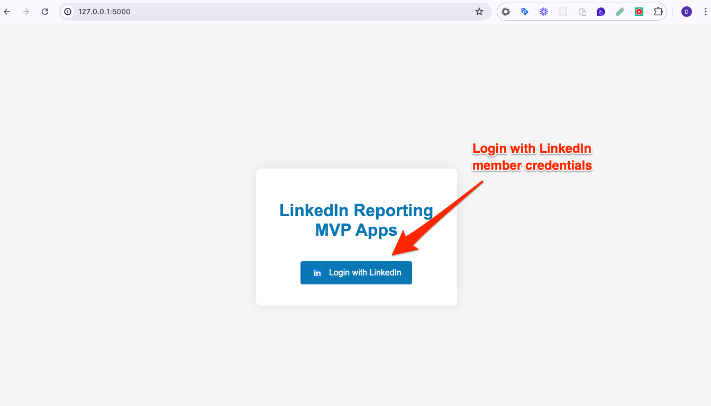

# LinkedIn Sample Report Apps (MVP)

## Introduction

This project sets up a basic Python Flask web application that allows users to log in using their LinkedIn accounts through OAuth 2.0, retrieves authenticated user data and download ABM campaign performance report from Ads account.

It's meant to be a Minimum Viable Product (MVP) to validate a business idea with minimal resources and effort by releasing a basic version of the product that includes only the essential features.

Developer is welcome to build on top of it to add more functionality and polish the user experience, or integrating into existing workflow.

## Pre-requistie

1. Create an app from [LinkedIn developer portal](https://developer.linkedin.com)
2. Make sure the app have added the required product. If it doesn't please request access. 
3. Create [LinkedIn Ads account](https://www.linkedin.com/help/linkedin/answer/a426102/create-an-ad-account-in-campaign-manager-as-a-new-advertiser). Ads account should include historic / current campaign performance data
4. Assume all the above requirements are met, developer should be able to spin up a MVP apps in 5 minutes.

## How to run

1. Create virtual environment

   `python -m venv venv`

2. Activate virtual environment \
   `source venv/bin/activate`

3. Install requirements
   `pip install -r requirements.txt`

4. Add client id, client secret, LinkedIn Ads account id in .env file. You should set the API_VERSION to the latest one according to [LinkedIn API documentation](https://learn.microsoft.com/en-us/linkedin/marketing/integrations/ads-reporting/ads-reporting?view=li-lms-2024-06&tabs=http) in the format "YYYYMM", it should NOT be older than 12 months from current date.

5. Provision redirect_url (http://127.0.0.1:5000/login/authorized) in apps under LinkedIn developer portal
   

6. Run flask app by
   `flask --app app run`

7. Open Chrome web browser in incognito window at :
   `http://127.0.0.1:5000/`

8. This app will retreive following ABM reporting metrics [analytics finder, MEMBER_COMPANY pivot](https://learn.microsoft.com/en-us/linkedin/marketing/integrations/ads-reporting/ads-reporting?view=li-lms-2024-05&tabs=http#statistics-finder) in the past 60 days

   - costInUsd
   - impressions
   - clicks
   - totalEngagements
   - externalWebsiteConversions
   - externalWebsitePostViewConversions
   - externalWebsitePostClickConversions
   - oneClickLeads

9. Because analytics finder only supports 1 pivot, if developer wants to see the breakdown by campaign please apply campaign filter in the API and make multiple API calls.

## Limitations and Further Enhancements

1. To further enhance the apps, developer may persist the access token in the apps and implement token refresh routine
2. Developer may store the data in database or sync the data in dashboard
3. Developer may implement the UI logic to retrieve performance data with muliple Ads account
4. Developer may implement the UI logic to specifiy time period of report and implement a scheduler to run the apps

## Troubleshooting

1. If developer run into api error, please clear all caches/cookies in current window or launch a new incognito window.
2. If developer find a bug, please submit new issue in github.

## MVP Screenshots

